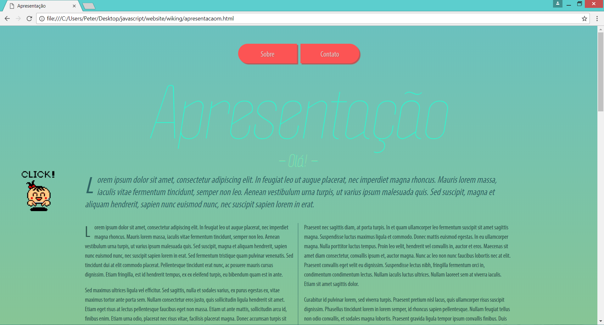

# Intro-website
A responsive presentation website that uses JQuery, bootstrap, google maps API, sends and fetches JSON (AJAX) + uses some basic PHP back-end functionalities. The design was done by me as well.

